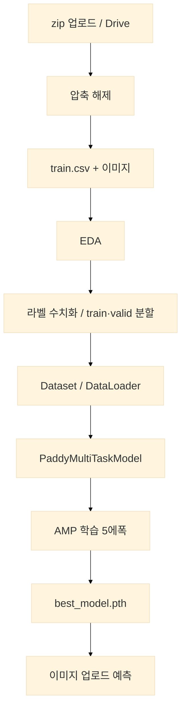
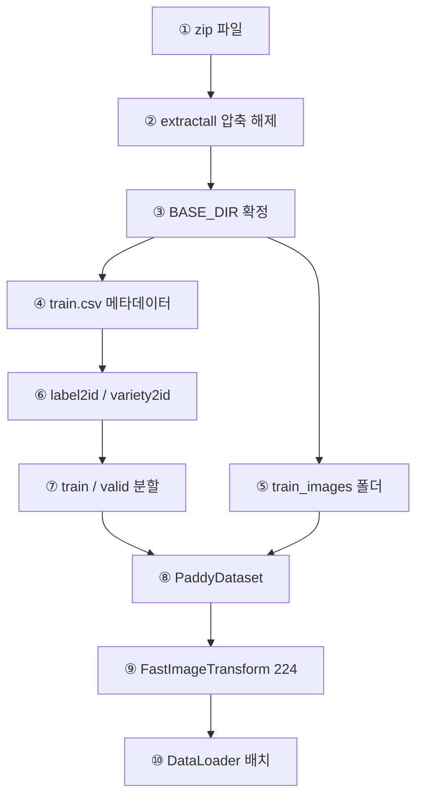
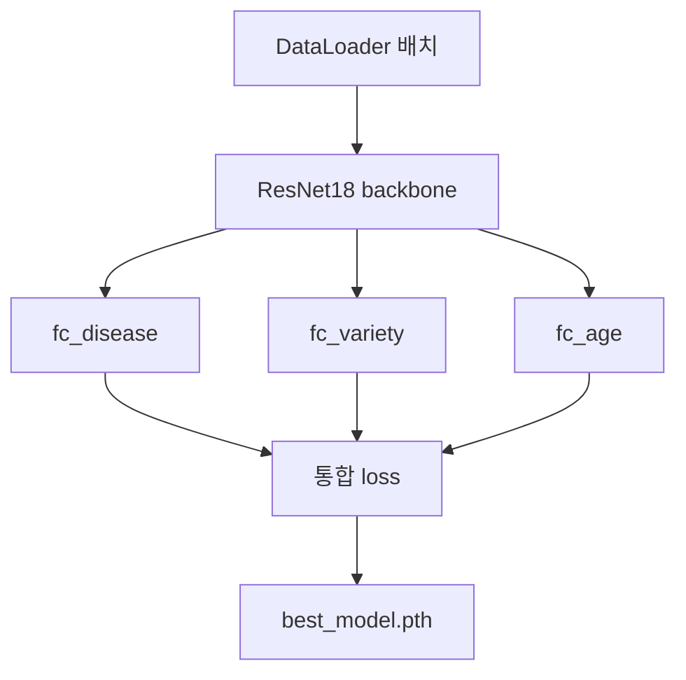
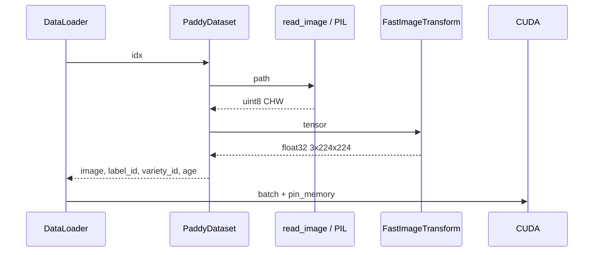
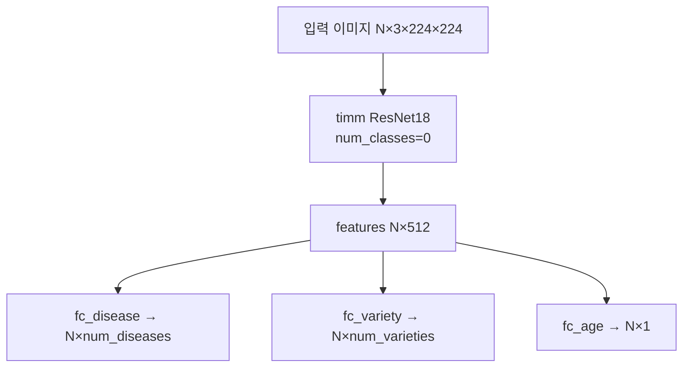
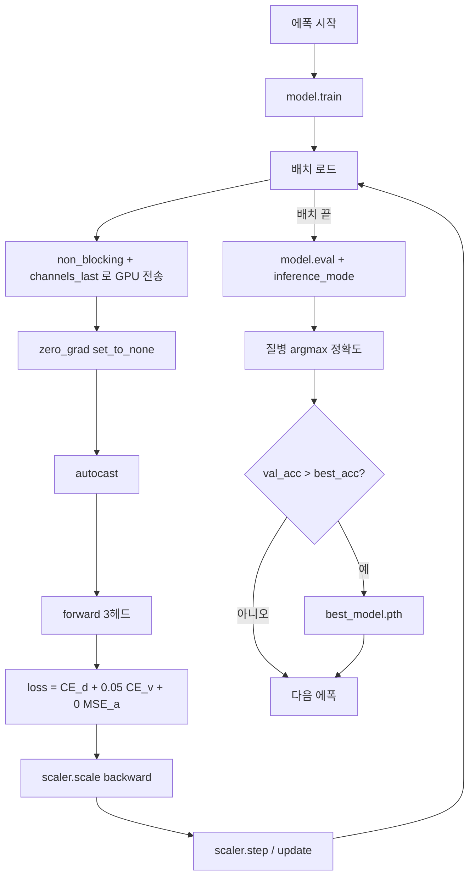
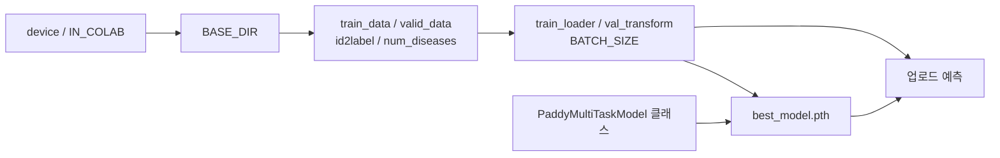

# `paddy_doctor_colab.ipynb` 동작 구조

Google Colab에서 Paddy Doctor(벼 잎) 이미지를 학습하고, 업로드한 사진의 질병·품종·생육 일수를 예측하는 노트북의 내부 흐름을 정리한다.

---

## 1. 한 줄 요약

zip 데이터를 풀어 CSV와 이미지를 맞춘 뒤, ResNet18 백본에 헤드 3개를 붙여 **멀티태스크 학습**을 하고, 검증 정확도가 가장 좋은 가중치를 저장한 다음 **파일 업로드로 추론**한다.



---

## 2. 노트북 구성

셀은 안내 마크다운과 실행 코드가 섞여 있다. 실행 순서는 위에서 아래이다.

| 단계 | 셀 | 역할 |
|---|---|---|
| 환경 | 1–2 | `timm` 설치, `device`, `IN_COLAB`, cuDNN/TF32 |
| 데이터 준비 | 3–6 | Drive/업로드, zip 탐색, 압축 해제, `BASE_DIR` 결정 |
| EDA | 7–11 | 건수, 질병/품종 분포, 생육 일수, 클래스별 샘플 이미지 |
| 전처리 | 12–13 | 경로 생성, ID 매핑, 8:2 분할 |
| 로더 | 14–15 | `FastImageTransform`, `PaddyDataset`, DataLoader |
| 모델 | 16–17 | `PaddyMultiTaskModel` 정의 |
| 학습 | 18–19 | AMP 학습, 검증, 체크포인트 저장 |
| 추론 | 20–21 | `files.upload()` 후 Top-3 예측 |

셀 22는 비어 있다.

---

## 3. 전체 데이터 흐름

Mermaid에서 **subgraph를 쓰면** 노드가 겹치거나 화살표가 끊겨 보일 수 있다. 아래는 **한 줄 세로 흐름**과 **학습 헤드 분기**를 나눠 그린다.

### 3-1. zip → 텐서 배치



**설명:** zip을 풀면 `BASE_DIR` 아래에 CSV와 이미지 폴더가 생긴다. CSV는 ID 매핑·분할에 쓰이고, 이미지 경로는 `Dataset`이 읽을 때 CSV의 `label`·`image_id`와 조합한다. 두 갈래가 **⑧ PaddyDataset**에서 합쳐진다.

### 3-2. 배치 → 모델 → 저장



**손실식:** `loss = CE(질병) + 0.05 × CE(품종) + 0 × MSE(생육 일수)`

---

## 4. 단계별 동작

### 4.1 환경 초기화

- `%pip install -q timm`으로 백본 라이브러리를 설치한다.
- `google.colab` import 성공 여부로 `IN_COLAB`을 정한다. 이후 zip 업로드·Drive 마운트·예측 업로드가 이 플래그에 갈린다.
- `torch.cuda.is_available()`이면 `device=cuda`, 아니면 `cpu`.
- CUDA일 때 입력 크기 224가 고정이므로 `cudnn.benchmark=True`, TF32, `float32_matmul_precision=high`를 켠다. 같은 해상도에서 합성곱 알고리즘을 재사용해 속도를 올린다.

### 4.2 zip을 찾아 압축 해제

세 경로를 순서대로 쓴다.

1. `ZIP_PATH`에 파일이 있으면 그 경로
2. `/content`, `/content/drive/MyDrive`(Colab) 또는 `.`(로컬)에서 이름에 `paddy`, `disease`, `rice`, `농작`, `벼`가 들어간 zip
3. 그래도 없으면 Colab `files.upload()`

압축은 `EXTRACT_DIR`에 푼다.

- Colab: `/content/paddy-data`
- 로컬: `./paddy-data`

`find_dataset_root()`는 풀린 트리 전체를 걸어 `train.csv`를 찾는다. zip 안에 폴더가 한 겹 더 있어도 `BASE_DIR`이 그 폴더가 된다.

이후 모든 이미지 경로는 아래 규칙이다.

```text
{BASE_DIR}/train_images/{label}/{image_id}
```

### 4.3 EDA

`df = pd.read_csv(train.csv)` 한 장으로 분포를 본다.

- 질병·품종: 건수가 많은 순 countplot
- 생육 일수: 20 bin 히스토그램
- 각 질병 클래스에서 `sample(1, random_state=0)`으로 1장을 골라 3×4 격자에 표시

이 단계는 학습 텐서를 만들지 않는다. 데이터 품질을 눈으로 확인하는 구간이다.

### 4.4 전처리와 분할

문자열 라벨은 모델이 쓰지 못하므로 **정렬 후 0부터 ID**를 붙인다.

```text
sorted(unique labels)  → label2id / id2label / label_id
sorted(unique variety) → variety2id / id2variety / variety_id
```

정렬을 고정해야 노트북을 다시 실행해도 같은 클래스가 같은 ID를 갖는다. 나중에 `best_model.pth`에 `id2label`, `id2variety`를 같이 저장하는 이유이다.

분할:

```text
train_test_split(test_size=0.2, stratify=label, random_state=42)
```

질병 비율을 학습/검증에 유지한다. 전체 10,407장이면 Train 8,325 / Valid 2,082이다.

`sample_submission.csv`가 있으면 테스트 경로만 만들어 두고, 이 노트북의 학습·검증에는 쓰지 않는다. 최종 추론은 업로드 이미지이다.

### 4.5 Dataset / Transform / DataLoader

**이미지 한 장이 텐서가 되는 과정**



`PaddyDataset`은 pandas `iloc`을 매 샘플마다 호출하지 않는다. 생성 시 `path`, `label_id`, `variety_id`, `age`를 리스트/배열로 복사해 둔다.

`FastImageTransform`:

1. `uint8 → float / 255`
2. `224×224` 리사이즈 (`antialias=True`)
3. ImageNet mean/std 정규화

학습용·검증용 transform은 같다. 데이터 증강은 없다.

`auto_batch_size()`는 GPU 메모리로 배치를 고른다. Colab T4(약 16GB)는 12GB 이상이므로 **192**이다.

Colab이면 `NUM_WORKERS=2`, `persistent_workers`, `prefetch_factor=2`로 CPU가 다음 배치를 미리 만든다. 학습 로더만 `drop_last=True`라 마지막 불완전 배치는 버린다.

### 4.6 모델 구조

`PaddyMultiTaskModel`은 **공통 특징 + 헤드 3개**이다.



- `num_classes=0`이면 분류 헤드 없이 특징 벡터만 나온다. ResNet18은 보통 512차원이다.
- 질병·품종은 클래스 수만큼 Linear, 생육 일수는 실수 1개.
- 이미지 한 장으로 세 가지를 동시에 맞추는 구조이다. 잎의 병반·형태가 품종·일수와도 상관 있다고 가정한다.

학습 시에는 `pretrained=True`로 ImageNet 가중치를 불러오고, 예측 복원 시에는 `pretrained=False`로 빈 네트워크를 만든 뒤 `best_model.pth`만 넣는다.

### 4.7 학습 루프

한 에폭은 학습 → 검증 → 최고 모델 저장이다.



**손실**

| 헤드 | 함수 | 가중치 | 역할 |
|---|---|---|---|
| 질병 | CrossEntropy | 1.0 | 주 과제 |
| 품종 | CrossEntropy | 0.05 | 보조 과제. 너무 세게 주면 질병 학습을 방해할 수 있음 |
| 생육 일수 | MSE | 0.0 | 계산은 하지만 가중치 0이라 파라미터를 거의 안 움직임 |

검증은 질병 `argmax`만 본다. 품종·일수 정확도는 학습 중 로그에 안 나온다.

**GPU 쪽 세부**

- AMP: 합성곱 등을 float16으로 계산하고 `GradScaler`가 기울기 스케일을 맞춘다.
- `channels_last`: NHWC 메모리 배치로 Tensor Core에 유리하다.
- `non_blocking=True`: pinned memory에서 GPU 복사를 연산과 겹친다.
- 매 스텝 `loss.item()`을 호출하지 않고 20스텝마다만 tqdm을 갱신한다. CPU-GPU 동기화를 줄이기 위함이다.

Adam은 `lr=1e-3`이다. CUDA에서 fused Adam을 쓸 수 있으면 쓰고, 안 되면 일반 Adam으로 떨어진다.

### 4.8 체크포인트

검증 질병 정확도가 갱신될 때만 저장한다.

```text
best_model.pth
 ├─ model          가중치
 ├─ id2label       질병 ID → 이름
 ├─ id2variety     품종 ID → 이름
 ├─ num_diseases
 ├─ num_varieties
 └─ image_size     224
```

이름 사전을 같이 넣어야 추론 때 숫자 클래스를 `bacterial_leaf_blight` 같은 문자열로 되돌릴 수 있다.

### 4.9 업로드 예측

```mermaid
flowchart LR
    U[files.upload] --> W[/content/uploaded_images]
    W --> P[PIL RGB]
    P --> T[val_transform + batch dim]
    T --> M[PaddyMultiTaskModel eval]
    M --> SD[softmax 질병]
    M --> SV[softmax 품종]
    M --> SA[age 스칼라]
    SD --> TOP[Top-3 + 화면 표시]
    SV --> TOP
    SA --> TOP
```

1. `best_model.pth`가 없으면 중단한다.
2. 체크포인트로 모델을 만들고 `eval()`로 둔다.
3. Colab이 아니면 이 셀은 오류로 끝난다. 업로드 API가 Colab 전용이기 때문이다.
4. 각 이미지에 학습과 같은 `val_transform`을 적용한다. 학습 분포와 맞춰야 한다.
5. `inference_mode` + AMP로 한 번 통과한다.
6. 질병·품종은 softmax Top-3, 생육 일수는 회귀값이다.
7. 그림 제목과 콘솔에 파일명, 확률, 일수를 출력한다.

---

## 5. 셀 사이에서 이어지는 주요 변수



커널을 재시작하지 않고 중간 셀만 다시 돌리면, 위 변수가 없는 상태에서 실패할 수 있다. 처음부터 순서대로 실행하는 것이 맞다.

---

## 6. 설계에서 의도적으로 나눈 것

| 선택 | 이유 |
|---|---|
| 멀티태스크 3헤드 | 한 장에 질병·품종·일수가 같이 붙어 있음 |
| `WEIGHT_A = 0` | 일수 회귀가 질병 학습을 흔들지 않게 함. 추론 때는 값이 나오지만 학습 신호는 거의 없음 |
| 검증은 질병만 | 실습의 주 지표가 질병 분류이기 때문 |
| zip 자동 탐색 | Colab에서 경로가 매번 달라질 수 있음 |
| 업로드 추론 | 테스트셋 CSV 없이도 데모가 가능함 |
| 증강 없음 | CPU 디코딩을 단순하게 유지해 학습 시간을 줄임 |

---

## 7. 실행 시 기대 동작

1. GPU 런타임이 아니면 학습이 매우 느리다. 셀 2에서 CUDA 안내가 나온다.
2. zip이 크면 Drive가 업로드보다 빠르다. `MOUNT_DRIVE=True`, `ZIP_PATH`를 지정하면 된다.
3. T4에서 배치 192, 워커 2, 5에폭이면 수 분 안에 끝나는 것이 정상이다.
4. 마지막 셀을 실행하면 파일 선택창이 열리고, 올린 잎 사진마다 질병 Top-3가 표시된다.

이 문서의 흐름은 `paddy_doctor_colab.ipynb` 현재 코드와 대응한다.
